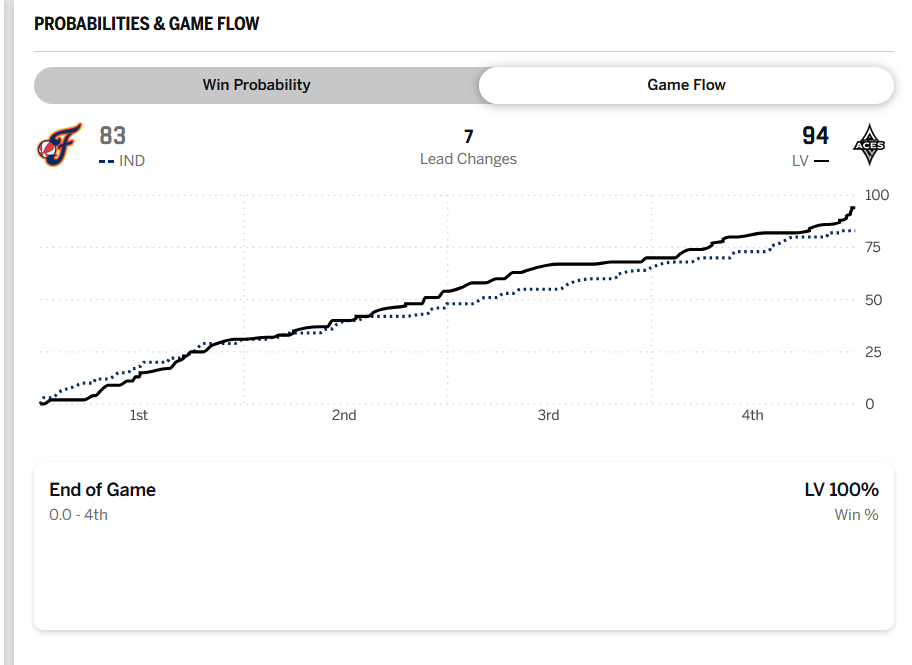
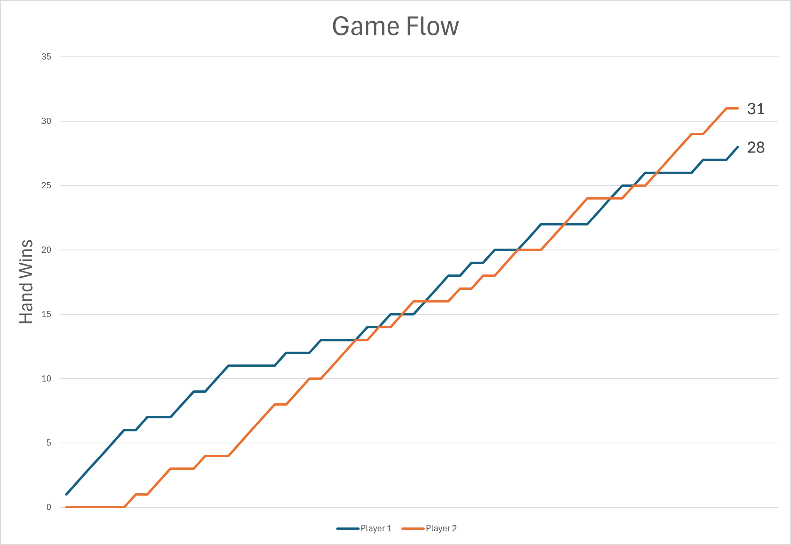

### Objectives

By the end of this lab you will be able to:
1. Use classes to create an object-oriented solution to a problem.
2. Implement a class.
3. Write Markdown.

## War Games

I really, _really_ have tons of trouble learning card games. As a native Ohioan, I know that I should love to play [Euchre](https://en.wikipedia.org/wiki/Euchre). I love watching [poker on TV](https://en.wikipedia.org/wiki/Chris_Moneymaker) but cannot get to the point where I feel comfortable enough with the rules to play it. I _used_ to know how to play Crazy Eights.

To make matters worse, I am really bad at the games that I do know how to play.[^sequence]

[^sequence]: My mom and cousin have recently introduced me to [Sequence](https://en.wikipedia.org/wiki/Sequence_(game)) ... and I seem to be okay at it. Here's to hoping!

When I was first starting as a computer science researcher, I did spend lots of time playing Solitaire. So, I feel okay saying that I can play that game. The only other card game I feel remotely comfortable playing is ... [War](https://en.wikipedia.org/wiki/War_(card_game)).

In this lab, we are going to use our Python skills to write a game that resembles War. We will build components using the skills that we learned to write object-oriented code in Python. Once we build those components, you will get to write the code to make those components communicate with one another in such a way that a fun game emerges.

Notice what I snuck in there: 

> ... components communicate with one another ...

If you remember, that is exactly the definition of a piece of software written in an object-oriented manner: independent software components communicating with one another to solve a problem.

If you are ready, let's get started!

## Thermonuclear War Games

In the Matthew Broderick movie War Games, the stars work to convince a rogue AI not to start a _real_ thermonuclear war after the system detects a _simulated_ attack. To do that, they force it to play game after game of tic-tac-toe so that it learns that some games are unwinnable.

"A strange game. The only winning move is not to play. How about a nice game of chess?"

In their honor, your game will be focused around decks of elements that can be combined into chemicals. The two players that you build will compete in rounds. The mechanics you design will determine what constitutes a round, what constitutes the winner of a round and what it means to win a game.

Like I said above, the fun part is on you -- together we will build up the tools for you to use your imagination.

## Ready, Player 1

Games need players. So, we will start with designing and implementing players. We will want players to keep track of certain information about themselves. Further, we will want them to be able to communicate with the other entities we develop.

As we discussed last week, a _class_ defines the prototype that can be used to _build_ instances. The class defines what is tracked (independently) by every _instance_ of that class and the operations that can be performed on those instances. Classes are like blueprints for a house. You can't live in blueprints, but you can live in a house that's constructed according to those blueprints.

First things first ... every player has a name. So, at a minimum, our `Player` class should specify that every player that is instantiated has a name -- their own name. Changing the name of one instance of a `Player` does not change the name of any other player.

To get started, look at the code in the lab that starts with 

```Python
class Player:
```

That code is the _class definition_ for the `Player` class. The code inside that class definition tells Python what is tracked (independently) by each of its instances _and_ specifies the mechanics of the operations that can be performed on each of those instances.

Next, in the class definition for the `Player` class

```Python
    name: str
```

is our way of telling Python that every instance of a `Player` will have a `name` attribute (whose value is a `str` -- a string). Based on what we decided (above), this code makes perfect sense: we said that _every_ instance of a `Player` has to have a name.

We've gone long enough attempting to avoid the elephant in the room: Where is the code that actually creates an instance of a `Player`? In other words, where do we get to define what happens when a user of our class instantiates a `Player`?

Before digging into that, let's switch our perspective ... so that we are now the _user_ of the code that defines the `Player` class. Forget about the fact that we are _also_ the person implementing the `Player` class. Writing code to create instances of the `Player` class will help us when we go back to doing the implementation. I promise.

Scroll down to the place in the code where you see 

```Python
if __name__=="__main__":
    # This is where we write code that
    # will execute when the program starts.
```

Let's say that we are attempting to create two players who are going to compete head-to-head in our game. The first player that we create will be named _Alsious_. When we instantiate a player with that name, we will want to assign it to a variable so that we can refer to the player. To do that, we would write a variable declaration/definition/initialization that looks like

```Python
    player1 = Player("Alsious")
```

The `Player("Alsious")` is what instantiates the `Player` instance. The `player1 = ` is what stores that instance into the variable named `player1`. 

Is it absolutely necessary that we specify a name when we instantiate a player? Yes, it is! There should be no way to instantiate a player without specifying a name. Let's see if Python properly prevents that:

```Python
    player2 = Player()
```

You should see that Python gives an error! It says that a name is required! Perfect. Go back and fix up that last line so that `player2` has a name. You should now have two instances of `Player`s -- one stored in `player1` and the other stored in `player2`.

Time to flip our perspective again ... and go back to implementing the class. Take a look at the code that looks like

```Python
    def __init__(self, name: str):
        self.name = name
```

That is the Python code that executed when we instantiated `Player`. When we instantiated `player1` and `player2`, we provided a name, so the `name: str` part makes perfect sense. But what about everything else? The `__init__` is just special syntax for the name in Python of the _method_ that executes when you make an instance of the class. And the `self` is a reference to the instance that is being constructed.

The `self` thing is a little mind bending at first, I'll admit. So, let's walk through it. 

When we instantiated `player1`, we wrote

```Python
    player1 = Player("Alsious")
```

Before executing the code in the `__init__` method, Python actually set up a unique place in memory to store the instance of the `Player` being created (among other things). Then, when it turned control over to our `__init__` method, it gave us a way to refer to that memory (`self`!) and the name `"Alsious"` (`name`). How cool?!

The

```Python
    self.name = name
```

is how we stash away for later the name specific to _that_ instance of the `Player` being instantiated.

Well, these players are all about competition and they are absolutely going to want to keep track of how many times they have defeated their opponents. So, let's make it so that our players keep track of their wins! Wins only come in whole numbers, so we will want to store that as an integer (what Python refers to as an `int`). Let's go back to the place in our code near where we specified that all `Player` instances have a `name` and add `wins` as something that all players have, too:

```
    wins: int
```

We don't want our players to cheat (by artificially boosting their initial win counts), so it should _not_ be possible for the programmer creating an instance of a `Player` to set the initial number of wins -- it should always start at `0`. So, in the `__init__` method, let's initialize

```
    self.wins = 0
```

Perfect!

The code that we have for the `Player` class definition should now look something like


```Python

class Player:
    name: str
    wins: int

    def __init__(self, name: str):
        self.name = name
        self.wins = 0
```

Now that we have specified the attributes that each player has, let's specify the operations that we can perform on instances of `Player`s. We clearly want to be able to access their name.

It would be cool if we could write something like

```Python
    player1_name = player1.get_name()
```

and have the `player1_name` variable contain the name of `player1` set when `player1` was instantiated. To make that possible, we will write a method named `get_name`.

In the `Player` class definition, let's write

```Python
    def get_name(self) -> str:
        return self.name
```

That defines (`def`) a method (which looks like a function but has the `self` as the first parameter) that will generate a value whose type is a string (`str`). Python was kind enough to automatically make it so that `self` matches the instance on which the `get_name` method was called, so we can use that to get the value that we so nicely stashed away in the code written in the `__init__` method!

Again, that `self` thing is really odd, but really important. It is what separates a function from a method. A method is basically a function that is always executed in the context of a particular instance of a class -- and we can refer to that instance using `self`!

For example, when we write

```Python
    player1_name = player1.get_name()
```

the code in the `get_name` method that we just wrote will execute and `self` will refer to `player1`. Later, if/when we write

```Python
    player2_name = player2.get_name()
```

the code in the `get_name` method that we just wrote will execute and `self` will refer to `player2`.

How cool is that?!?

Methods that "get" values of the attributes of instances of a class are known as _getters_ (or _accessors_). We should also write an accessor for the number of wins that a player has accumulated! 

```Python
    def get_wins(self) -> int:
        pass
```

I will let you write the body of that one! Look at `get_name` for inspiration!

So far so good. But, we are missing one really important feature: How can we increase a player's win total when they beat their opponent? What we need is a _setter_ (or a _mutator_) that will update the value of the player's win total. Let's write a method named `note_win` that will increment the count of the player's win total by one:

```Python
    def note_win(self):
        self.wins = self.wins + 1
```

Nice!!

Only one more piece of code that you will (probably) want to write before you start working on the fun part of your game: it would be great to be able to compare two players and determine which one has more wins!

I mean, it would be really cool if we could write something like

```Python
    if player1 < player2:
        print(f"{player2.get_name()} is the winner!")
```

There's only one problem: We are the ones that added the concept of a player to Python. The developers of Python had no idea that we might want to do that. So, how are we able to use the `<` as if players were part of the language from the beginning?

Python has a really cool system for specifying the behavior of instances of classes for the built-in operators (e.g., `<` or `==`, etc.). Using so-called _dunder_ methods (which is just a fast way to say "double underscore"), we can specify the behavior! 

In order to specify how to calculate whether one player has fewer wins than another, we use the `__lt__` dunder method (for `l`ess `t`han). Python takes code that looks like

```Python
    if player1 < player2:
        print(f"{player2.get_name()} is the winner!")
```

and turns it into 

```Python
    if player1.__lt__(player2):
        print(f"{player2.get_name()} is the winner!")
```

which is why we will implement our dunder method like

```Python
    def __lt__(self, other: 'Player') -> bool:
        pass
```

I will leave it up to you to determine whether the `self` player defeated the `other` player (but I bet that it will have to do with the number of wins that each has accumulated (which you can get by using the `get_wins` method!!))

### Done, Player 1

With that, the slow walkthrough for this lab is complete. You have successfully designed and implemented the `Player` class. To check whether everything about your `Player` class matches what we expect, try copying and pasting 


```Python
    player1 = Player("Alsious")
    player2 = Player("Bobapple")


    print(f"player1's name is {player1.get_name()}")
    print(f"player2's name is {player2.get_name()}")

    player1.note_win()
    player2.note_win()

    player1.note_win()
    player1.note_win()
    player1.note_win()
    player1.note_win()

    print(f"{player1.get_name()} has {player1.get_wins()} wins.")
    print(f"{player2.get_name()} has {player2.get_wins()} wins.")

    if player2 < player1:
        print(f"{player1.get_name()} wins!")
    else:
        print(f"{player2.get_name()} wins!")
```

beneath

```Python

if __name__=="__main__":
```

and seeing what you get. 

Your output should be

```
player1's name is Alsious
player2's name is Bobapple
Alsious has 5 wins.
Bobapple has 1 wins.
Alsious wins!
```

## Game On

What's next? Let the fun begin -- it's time for you to build your game!! You can combine the ability to model players (that you implemented) with other tools that I have provided for you to create a fun game.

I have provided you the `Element`, the `Chemical`, the `PeriodicTable` and the `Game` class.

Let's take a tour of some of that functionality ... so you can turn it into an [addictive game](https://en.wikipedia.org/wiki/Candy_Crush_Saga)!

### `Element`

An instance of the `Element` class represents, well, an element from the periodic table. The `name` and `mass` are the only two characteristics of an element that the class tracks.

If you have an instance of an `Element`, you can access its name and its mass:

```Python
    element_mass = element1.mass()
    element_name = element1.name()
```

Instances of `Element` can also be formatted nicely as strings:

```Python
    print(f"{element1}")
```

The best feature of instances of `Element`s is that when you add them together ...

```Python
    c = element1 + element2
```

... you get an instance of a ...


### `Chemical`

An instance of a `Chemical` class represents ... you guessed it ... a chemical! Like instances of an `Element`, instances of `Chemical`s have names and masses. The mass of an instance of a chemical is simply the sum of the masses of the instances of `Elements` from which it is composed.

For example, in

```Python
    e1 = Element("Pretend", 1)
    e2 = Element("Real", 8)

    c1 = e1 + e2
```

the instance of `Chemical` in `c1` has a mass of 9.

If you have an instance of a `Chemical`, you can add additional instances of `Element`s and you will get new instances of `Chemical`s.

For example, building on the previous example, in

```Python
    e3 = Element("Next", 40)

    c2 = c1 + e3
```

the instance of `Chemical` in `c2` has three elements and a total mass of 49.

And, as Steve Jobs would say, there's one more really cool thing about instances of `Chemical`s: You can compare them with the `<` to determine which one has the higher mass:


```Python
    if c1 < c2:
        print("c1 is less than c2!")
```

### `PeriodicTable`

Oh, but Will, making instances of `Element` by hand is _so_ hard. There has to be a better way?! Well, there is! With an instance of the `PeriodicTable` class, you can pull out random elements one at a time:

```Python
    pt = PeriodicTable('./periodic.csv')

    random1 = pt.random()
    random2 = pt.random()
```

Of course, if you pull out all the elements in the Periodic Table, you will get `None` rather than an instance of an `Element`.

### `Game`

The final tool that you might find useful is the `Game` class. Besides the ability to track instances of two `Player`s, there is not much functionality -- it's wide open for you to run wild!

## Just Do It

Ok, time for you to Just Do It. In the spirit of letting you explore and be creative, the requirements for the submission for this lab are very broad. 

There are two requirements:

1. You must submit a [_markdown_](https://docs.github.com/en/get-started/writing-on-github/getting-started-with-writing-and-formatting-on-github/basic-writing-and-formatting-syntax)-formatted file describing:
    1. the name of the game you created;
    2. the mechanics of the game; and
    3. how to execute the code that you wrote to play the game.

2. You must submit the code for the game (in _any_ format that I will be able to run). **Note**: See (1.3), above.

There are myriad opportunities for extra credit -- anything that you do above and beyond what is required will earn you extra credit. The more creative the additional features, the better!

As an example, in my game, I implemented a Game Flow (like the one on ESPN.com):




